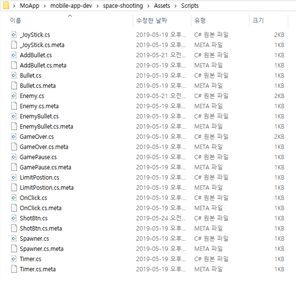
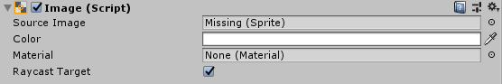

## 유니티 .meta 파일은 뭐길래 모든 asset마다 생성이 될까?

### 결론부터 말하자면 meta파일은 asset을 식별할 수 있게하는 고유한 값이랑 그asset에 대한 설정 정보를 저장하는 역할을 한다.

아래의 사진을 보면 모든 Asset(아래 사진에서는 스크립트들)에 해당하는 메타 파일 생성되었음을 확인해 볼 수 있다.

---

유니티의 내부처리를 이해하면 메타 파일에 대해서 이해할 수 있다.  
이 부분에 대한 내용은 \[[유니티 매뉴얼: Behind the Scenes](https://docs.unity3d.com/kr/530/Manual/BehindtheScenes.html)\]을 참고했습니다.

### Asset을 import하거나 새로운 파일을 (유니티 Assets폴더 안에) 생성하면 Unity 안에서는 어떤일이 일어날까?

#### **1\. 먼저 unique한(하나만 존재하는) ID값을 할당한다.**

-   유니티는 어떤 에셋을 Assets폴더에 안에 넣으면 새로운 파일이 추가됐다는 것을 감지한다.  
    (유니티 에디터는 주기적으로 알고 있는 asset 목록을 기반으로 새로운 asset이 들어왔는지 찾는다고 한다)
    
-   유니티는 새로운 파일이 발견되었다면 바로 그 asset에 대한 Unique한 ID를 부여한다. 이 ID는 유니티 내부적으로 asset을 참조하는데 쓰인다. 그렇게 함으로써 유니티는 asset의 이름을 수정하거나 위치를 바꿔도 unique한 ID를 통해 그 asset을 찾을 수 있게된다. 
    
-   조금 더 구체적으로 설명을 해보겠다.  
    내가 유니티 Assets폴더 안에 있는 groot.jpg파일을 이용해 작업을 하고 있었다고 해보자.  
    Unity는 asset을 unique한 ID를 통해 찾으므로 groot.jpg파일을 Assets/Resources/Sprite 폴더로 파일을 옮기거나 Groot.jpg로 이름을 바꿔도 (그 파일이 뭐였는지 잃지 않고) ID를 통해 그 파일을 참조할 수 있다.
    

#### **2\. 그 다음으로 .meta 파일을 생성한다.**

좌변의 윈도우 탐색기로 연 Assets 폴더를 보면 각각의 asset(Scenes폴더와 groot.jpg)에 대응되는 meta파일들이 만들어졌는 것을 볼 수 있다. 유니티 프로젝트 창(Project View)에서는 default로 .meta파일이 안보이도록 설정되어있다. 

-   위의 1.에서 설명했던 unique한 ID는 meta파일에 저장된다. meta파일은 asset이 존재하는 폴더에 생성이 되고 대응되는 \[asset명\].meta로 이름이 설정된다.
    
-   groot.jpg를 추가했으면 groot.jpg.meta파일이 생성된다.
    
-   **유니티 내**에서 asset파일을 옮기거나 이름을 바꾸면 meta파일도 자동으로 위치(디렉토리)를 파일이 있는 곳으로 옮겨주고 meta파일의 이름을 변경된 asset파일명으로 바꿔준다.
    
-   하지만 **유니티 외부**에서 파일을 조작할 경우는 아니기 때문에 메타 파일을 수동으로 바꿔줘야 한다.
    
-   유니티 내에서 파일을 옮기지 않고 윈도우 탐색기나 맥의 finder를 사용해서 Assets폴더 내의 파일들의 이름을 바꾸거나 파일을 옮기면 meta파일을 잃어버리게 된다.  
    그렇기 때문에 유니티 외부에서 파일을 옮길 때는 해당하는 meta파일도 같이 옮겨주고 유니티 외부에서 파일명을 바꿀 때는 meta파일명도 변경해주자!   
    이렇게 하면 meta파일을 잃어버리지 않는다!
    

---

### 어떤 asset의 메타 파일을 **날리거나 누락하면** 어떻게 될까? 

-   유니티 외부에서, 예를 들어서 윈도우 탐색기에서, groot.jpg 파일을 grootDancing.jpg로 파일명을 수정하고 유니티로 돌아와보자.   
      
    유니티에서는 어떤일이 일어나게 될까?  
       
    유니티에 돌아오면 grootDancing.jpg.meta파일이 없으므로 grootDancing.jpg파일은 새로 Import된 파일과 동일한 취급을 받는다.  
    유니티는 grootDancing.jpg를 식별하기 위한 새로운 ID를 부여하고 다시 grootDancing.jpg.meta파일을 만들고 ID를 저장한다.  
    처음에 생성된 메타 파일인 groot.jpg.meta파일은 대응되는 asset파일이 없으므로 삭제된다.   
      
    만약 Image Component의 속성인 Source Image에 groot.jpg를 할당해 줬다면 그 속성은 groot.jpg.meta파일에 있는 ID값으로 대응되는 asset을 찾으려고 할 것이다. 그런데 이름이 수정된 grootDancing.jpg파일은 새로운 ID값을 발급 받았으므로 불쌍한 우리 Image Component는 아무것도 찾지는 못하게 된다. 아무것도 못찾은 Image Component는 해당하는 속성을 Missing이라고 표시한다.
    

-   asset이 존재하는 폴더 옆에 meta파일이 없어도 마찬가지이다. 유니티 외부에서 파일을 옮길 때는 메타파일과 같이 옮겨주자!
    

---

## meta 파일은 asset에 대한 설정 정보(Import Settings)를 저장한다.

-   위에서 내린 결론을 보면 meta파일은 asset에 대한 설정 정보도 저장한다고 말했었다.
    
-   구체적으로, meta파일은 asset의 **Import Settings**를 저장한다.   
    (Import Settings는 Asset의 형태와 어떻게 나타낼지에 대한 정보들의 집합이다.)
    
-   Import Settings는 Project View에서 asset을 클릭하면 Inspector에 나타난다.  
    (asset의 형태에 따라 Import Settings는 다르다.)
    
-   예를 들어서 Image의 Import Settings로는 Texture Type, Wrap Mode, Aniso Level, ...등이 있다. 
    

-   FBX파일의 Import Settings으로는 Scale Factor, Convert Unit, Mesh Compression, Optimize Mesh, ...등이 있다.
    

-   meta파일을 실수로 없앴을 때 다시 missing된 부분만 넣어준다고 생각할 수도 있다. 하지만 meta파일은 Import Settings도 저장하고 있기 때문에 만약에 meta파일이 누락되면 Prefab이 깨지거나 FBX설정이 초기화되는 등 엄청 많은 문제를 일으킬 수 있으니 **주의**하자.
    

---

### git으로 협업할 때, 작업한 asset + 작업한 asset의 meta파일도 올리도록 주의하자.

만약 meta파일이 누락된 채로 push가 되는 순간 프로젝트는 숨은 커밋? 찾기가 시작될 것이다. 어느새 각각의 팀원마다 새로운 meta파일이 생겨나게 될 것이다. 그러다가 각각의 팀원이 git에 push하기 시작할 것이고 그 이후부터는 매번 충돌이 날 것이다.... merge를하면 프로젝트의 한부분이 망가지고 오류를 내기 시작할 것이고 그 이후부터는 조금 많이 화나지 않을까....?  
  

---

### 유니티 외부에서 파일을 공유할 때 meta파일을 누락하기 쉽다.  
그럴 때는 **Unity Package**의 형태로 공유하면 편하다. 

-   Unity Package에는 meta파일 정보도 다 저장이 된다.  
    그렇기 때문에 Export를 해서 Unity Package의 형식으로 파일을 주고 받으면 meta파일을 누락시키는 걱정은 안해도 된다.
    
-   Unity Asset Store에 있는 asset들을 생각하면 왜 편한지 알 수 있다.  
    Unity Asset Store에 있는 asset들은 Unity Package의 형식으로 업로드 된다. 그래서 구매한 asset을 Import를 해도 reference를 잃지 않는 것이다.
    

---

## 결론

1.  유니티는 새로운 asset이 인식되면 그 asset을 참조하기 위한 ID를 발급하며 이 ID는 meta 파일에 저장된다.
    
2.  meta 파일은 Import Settings도 저장한다.
    
3.  유니티 내에서 작업하자.  
    유니티 외부에서 Move, Rename하면 meta 파일명을 직접 수정해줘야 한다.
    
4.  외부에 파일을 공유해야 될 상황이 생기면 Unity Package형식으로 공유하는게 편하다.
    
5.  협업 시 meta 파일이 중복되어 생성되지 않도록 주의하자!